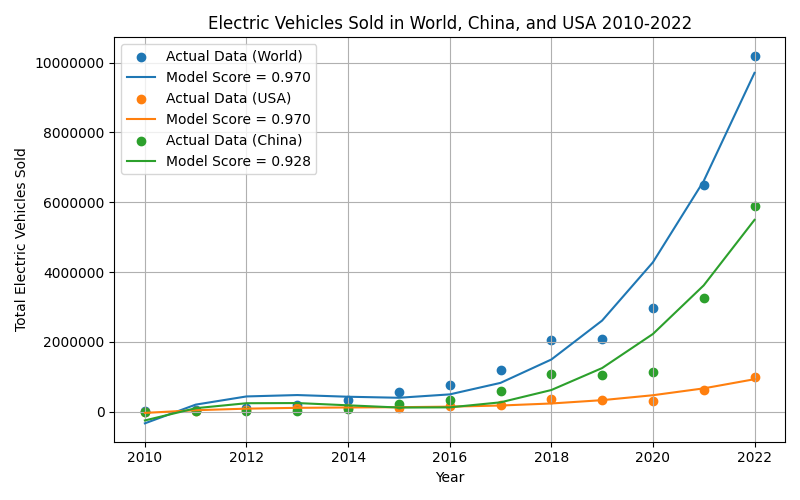
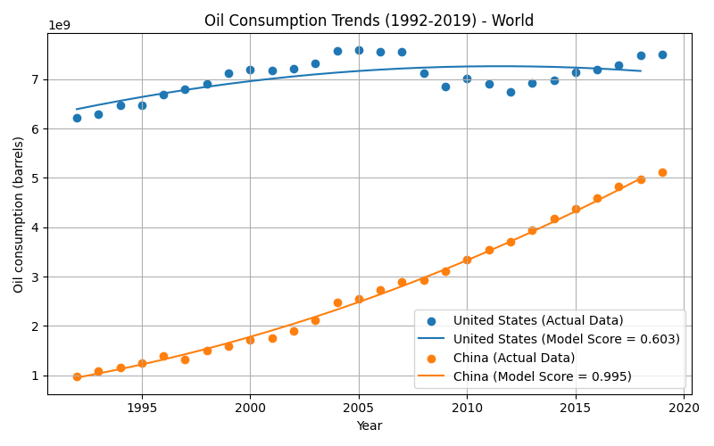
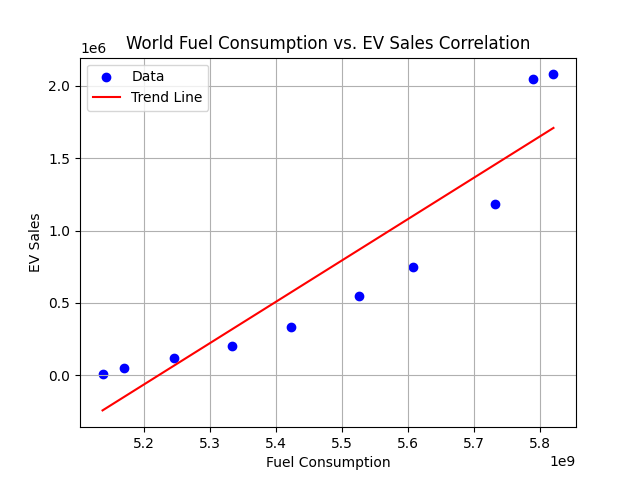

# Fossil Fuel Consumption, Gas Prices & EV Sales

A data analysis of oil consumption, gasoline prices, and electric vehicle sales across the top oil-consuming countries (US, China, India, Japan, Russia) and the world. The question: **are EV sales connected to fuel consumption or gas prices yet?**

Team project (3 people) · CMPT 353 Computational Data Science (Greg Baker), Simon Fraser University · Summer 2023
Team: Parmveer Dayal, Edoardo Rinaldi, Kyle Mollard

**Stack:** Python · pandas · NumPy · scikit-learn · statsmodels · matplotlib · Jupyter



---

## Summary

- **EV sales are growing fast almost everywhere.** A degree-3 polynomial fits world, US, and China sales well (R² ≈ 0.93–0.97). Japan and India don't fit: Japan's sales dipped in 2018–2020, and India's 2021–2022 jumps act as outliers.
- **Oil consumption is still rising** for every country studied except Japan, which declined steadily over 1992–2019.
- **World EV sales and world fuel consumption are strongly positively correlated** (r ≈ 0.93). This is not evidence that EVs drive fuel use. Both series trend upward over the same years, so the correlation mostly reflects the shared trend. At the country level the results were mixed: China was strongly positive (r ≈ 0.89), while Japan was negative.
- **Gas prices and EV sales are only weakly correlated** worldwide (r ≈ 0.31), so price spikes don't clearly track EV adoption in this data.

## My role

- Cleaned and transformed the three datasets with pandas and NumPy ahead of model fitting.
- Investigated outliers to understand their real-world causes. For example, Russia's 1992 consumption right after the USSR breakup, the US 2004–2007 consumption spike, and the 2014–2016 oil price collapse.
- Compared scikit-learn methods (polynomial regression, k-NN, Random Forest, MLP) for the forecasting models.
- Co-wrote the technical report, coordinating through GitHub and Google Docs.

## Data

| Dataset | Source | Coverage |
|---|---|---|
| `Fuel_production_vs_consumption.csv` | [Kaggle: Worldwide fuel production and consumption](https://www.kaggle.com/datasets/shawkatsujon/worldwide-fuel-production-and-consumption) | 1980–2019 (1992+ used) |
| `gas_prices.csv` | Compiled from [IEA end-use prices](https://www.iea.org/data-and-statistics/data-tools/end-use-prices-data-explorer?tab=Yearly+prices) | 2006–2022 (China from 2009) |
| `IEA-EV-dataEV-salesCarsHistorical.csv` | [Kaggle: Historic sales of EVs](https://www.kaggle.com/datasets/edsonmarin/historic-sales-of-electric-vehicles) | 2010–2022 (Russia from 2015) |

## Approach

| Analysis | Method |
|---|---|
| Oil consumption (`fuel.py`) | Crude oil only, grouped by country and year. Started in 1992 to avoid the USSR breakup discontinuity. Polynomial regression (degree 2; degree 3 for the US). |
| Gas prices (`gas.py`) | Polynomial features or k-NN regression chosen per country, with larger test splits because of very few data points. Random Forest and MLP were tried and dropped. |
| EV sales (`ev.py`) | Yearly totals per country. Polynomial (degree 3) regression outperformed k-NN and Random Forest. |
| Correlation (`correlation.ipynb`) | Pearson correlation (`np.corrcoef`) between EV sales and fuel consumption, and between EV sales and gas prices, by country and worldwide. |

| Oil consumption: US vs. China | World fuel consumption vs. EV sales |
|---|---|
|  |  |

## Limitations

Looking back at this work:

- **Small samples.** There are only about 10–17 yearly points per series. Several fits use polynomials up to degree 5 on that little data, so the R² values should be read as descriptive, not predictive.
- **Trend-driven correlation.** Correlating two upward-trending time series inflates r. Differencing the series or correlating year-over-year changes would be a fairer test.
- **Long extrapolation.** Extending consumption forecasts to 2100 goes far beyond the data's range.
- **One conversion rate for every country.** The analysis assumes Canada's crude-to-gasoline conversion rate (~65%) applies everywhere.

## Running it

```bash
pip install numpy pandas matplotlib scikit-learn statsmodels
python fuel.py   # oil consumption  → plots/consumption/
python gas.py    # gas prices       → plots/cost/
python ev.py     # EV sales         → plots/EVSales/
```

Open `correlation.ipynb` in Jupyter for the correlation analysis (→ `plots/correlations/`).

The full write-up is in [`CMPT 353 Project.pdf`](CMPT%20353%20Project.pdf).

*Originally developed on SFU's GitHub Enterprise and mirrored here.*
